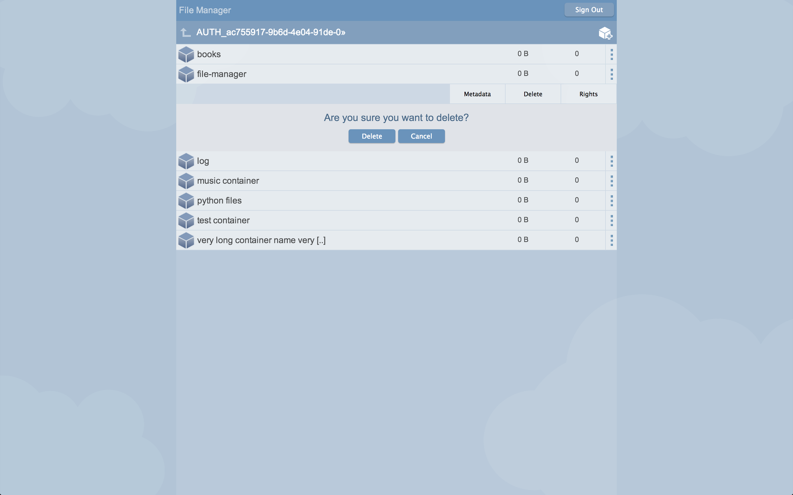
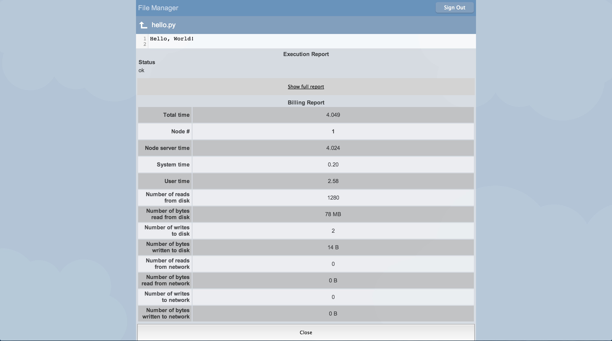

File Manager
============

File Manager is a web UI for Zwift (https://github.com/zerovm/zerocloud) and for OpenSatck Swift. It is open source.

Installation
------------

Assuming that Swift/Zwift is already installed, there are two options to install File Manager:

1. Install it on apache or any other web frontend. Just by copying all the files under any URL. The only requirement is that the URL domain part of the URL should be the same as SWift URL.
I.e. if Swift is under "https://something.domain.org/v1/" then FileManager should be: "https://something.domain.org/some/other/url"

2. Install it by copying it into your account on Swift. Can be accomplished by command line tool, for example.
I.e. `swift -A https://auth/url -U mytenenat:myuser -K mypassword upload file_manager_container file/manager/path/on/local/disk

Supported Browsers
------------------

Last time tested on:
* Chrome 34
* Firefox 29
* Safari 7

Files Description
-----------------

* Swift.js - implementation in JavaScript of Swift V1 API (http://docs.openstack.org/api/openstack-object-storage/1.0/content/) and Zwift (https://github.com/zerovm/zerocloud).
* FileManager.js - The UI itself.
liteauth.js - implementation in JavaScript of Liteauth (https://github.com/zerovm/liteauth)

Third-party dependencies
------------------------

* CodeMirror (http://codemirror.net/) - JavaScript library used for the editor.

Backend
-------

* OpenStack Swift - https://github.com/openstack/swift
* Zwift - https://github.com/zerovm/zerocloud
* Liteauth - https://github.com/zerovm/liteauth

Enable and Disable Execute Feature
The Execute feature can be enabled/disabled by changing the following variable in FileManager.js file:
FileManager.ENABLE_ZEROVM = true;

Screenshots
-----------

Features
--------
* view containers list
   * view container size, sometimes this information is not accurate because Swift is eventually consistent.
   * view number of files in a container, sometimes this information is not accurate because Swift is eventually consistent.
   * listed a limited number of containers, when the page is scrolled down or “load more” button is clicked then more containers are loaded
* create container
* delete container
  * ability to delete a container that contains files, it is done not in one transaction, because Swift V1 API does not allow to delete container that contains files.
* change container metadata
* change container rights
* view files list
  * know the file type, there are many icons for various file types
  * view file size
  * see when last time file changed
  * view pseudo-directories
  * listed a limited number of files, when the page is scrolled down or “load more” button is clicked then more files are loaded
* create pseudo-directory, it is done by creating a file with content type “application/directory”, it is specified in Swift V1 API.
* create file
  * ability to choose a content type for the file when creating it
* upload files
  * ability to upload multiple files
  * progress bar with percents that indicate how much been uploaded
  * cancel upload option
* upload as, an ability to choose file name, and file content type before uploading it
* upload and execute, Execute is not part of Swift, it is part of Zwift (https://github.com/zerovm/zerocloud).
* delete file and pseudo-directory
  * ability to delete pseudo-directory that contains files, it is done not in one transaction, because Swift V1 API does not allow to delete pseudo-directory that contains files.
* change file content type
* change metadata of a file and pseudo-directory
* edit text file
  * line numbers
  * syntax highlighting for several programming languages
  * undo and redo
  * save file changes
  * save as
  * download the file
  * JSON and python files: execute, Not part of Swift
  * open (type of execution), Not part of Swift
* The user can navigate in File Manager by clicking on containers, directories, files, and clicking on “up” button.
  * back and forward buttons in the browsers are supported